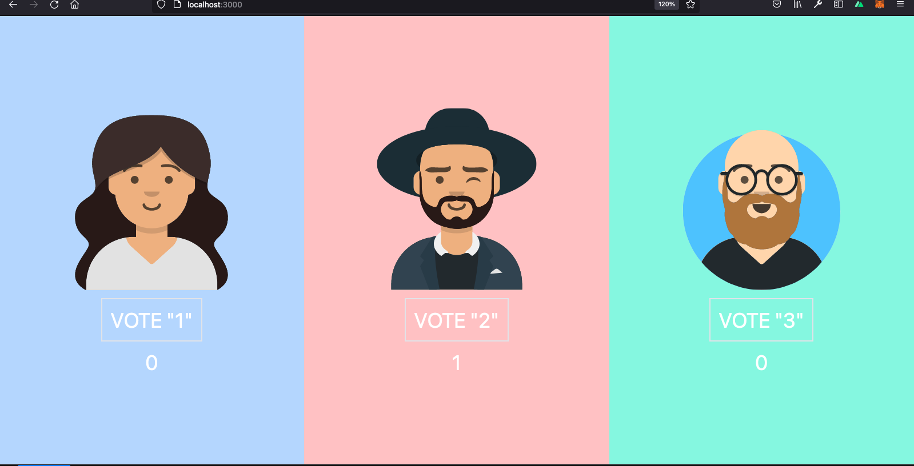
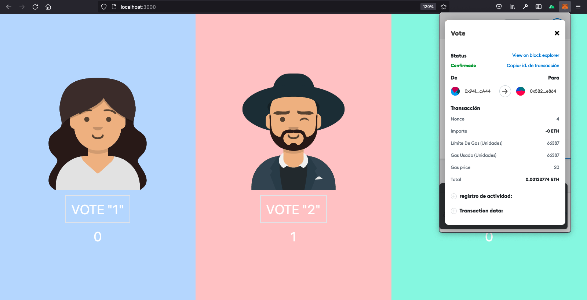

# VotingDapp
### Requirements

 1. Ganache CLI (I use in Docker env) 
 2. Truffle ( Easy to manage the contract and interact) 
 3. Openzeppelin (  Contracts Library )
 4. Ethers.js (JS Library that allows to interact with providers and EVM)  

### RUNNING
	

 - Change truffle config file for ganache settings
 -  Deploy and migrate the smart contract 
 - Create account in metamask with some ethers and connect with the Dapp 
 - Vote! 
 - You can set the poll using the modifier  

## To - do 

 - Each vote need's to pay Gas to cast the vote to the blockchain   ( we can use signature and delegate the cast to another wallet ) I'm looking to an alternative to cast that signature though IRC or another p2p network  (just not store it in db) 
 - Use IPFS to handle a json file with the metadata of candidates 
 - Set expire  

 

## Screens 

